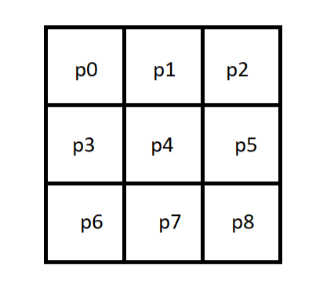
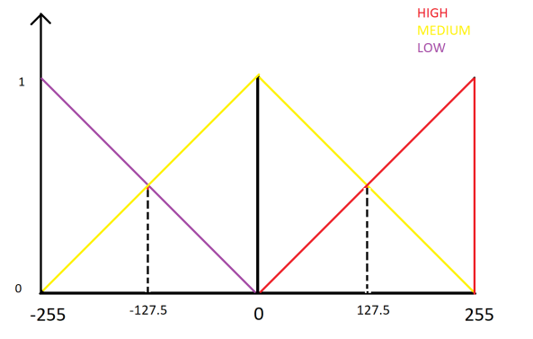
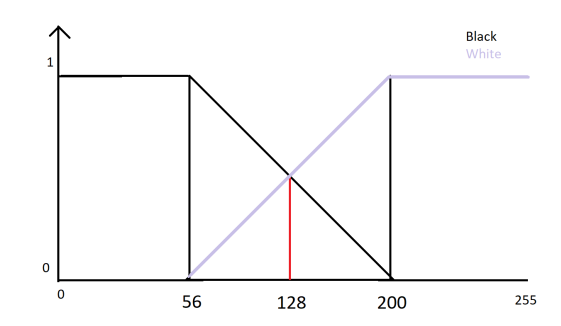
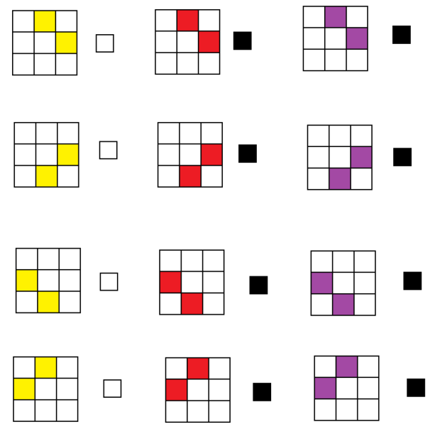

# Fuzzy Edge Detection

I implement an edge detector using fuzzy logic

## Logic
i choose `3*3` kernel

after that we have to set mean to zero and by normalizing pixel value and fuzzifying pixels by this chart

Then we have to choose fuzzy logic for decide that one pixel is edge or not. this is my rules :

## Results
Image             |  Edge-Etected Image
:-------------------------:|:-------------------------:
  |  
| 
| 
 | 
 | 
