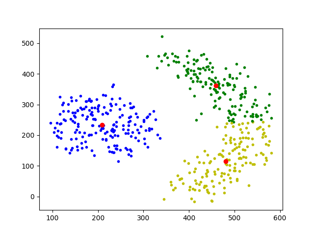

# Fuzzy CMean

### Fuzzy C-means clustering overcomes this limitation. It was developed by J.C. Dunn in 1973, and improved by J.C. Bezdek in 1981. It allows one piece of data to belong to two or more clusters and the point is in each cluster upto a certain degree (based on the membership function). 

### In this project i implement FCM and try it on 4 datasets
*   [data1](./data/data1.csv)
*   [data2](./data/data2.csv)
*   [data3](./data/data3.csv)
*   [data4](./data/data4.csv)

### RUN
       python3 main.py

### Result
This the result for data2

